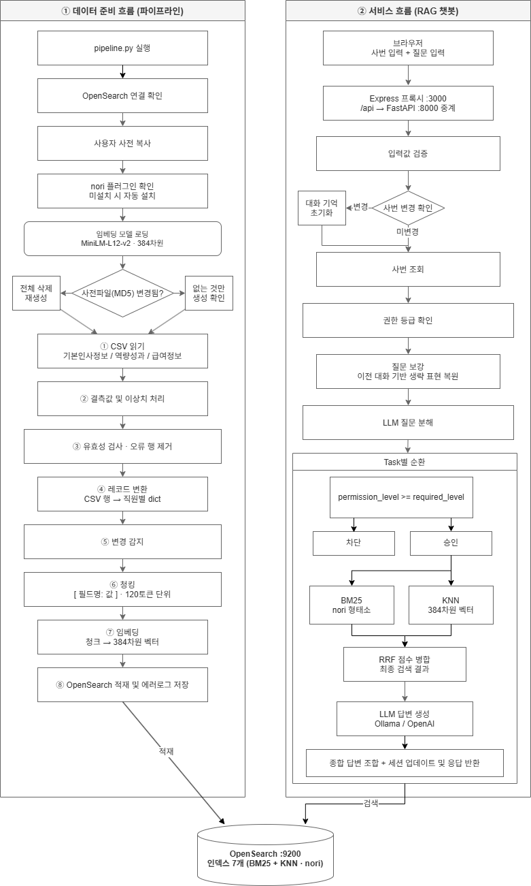

# 두리안정보기술 인사 데이터 RAG 챗봇

인사 데이터를 OpenSearch에 적재하는 **데이터 파이프라인**,
권한 기반 검색·답변을 제공하는 **FastAPI 백엔드**,
사용자가 질문을 입력하는 **챗봇 UI(HTML + Alpine.js)** 까지 포함된 통합 시스템입니다.
원본 CSV → 정제 → 인덱싱까지 한 번에 처리하고, RAG 방식으로 LLM이 답변을 만듭니다.

---

## 전체 흐름 요약

```
GitHub Clone
    ↓
OpenSearch 실행 (nori 플러그인은 파이프라인이 자동 설치)
    ↓
Node.js 설치
    ↓
Ollama + gemma3:4b 모델 준비
    ↓
원본 CSV 배치 (data/dataset/)
    ↓
환경 변수 설정 (.env)
    ↓
Python / Node.js 의존성 설치
    ↓
파이프라인 실행 (데이터 적재)
    ↓
FastAPI 백엔드 + Express 프론트 구동
    ↓
브라우저에서 챗봇 사용
```

---

## 사전 요구사항

| 항목 | 버전 |
|------|------|
| Python | **3.10 이상** |
| Node.js | 18 이상 (LTS 권장) |
| OpenSearch | **3.3.2** (nori 플러그인은 파이프라인 실행 시 자동 설치) |
| Ollama | 최신 |
| Git | 최신 권장 |

---

## STEP 1 — 프로젝트 다운로드

```bash
git clone https://github.com/durianpj/Durian.git
cd Durian
```

---

## STEP 2 — OpenSearch 준비

`localhost:9200`에서 OpenSearch가 동작 중이어야 합니다.

> **nori 플러그인은 별도 설치 불필요** — 파이프라인 실행(STEP 7) 시 자동으로
> 다운로드/설치해줍니다. 단, 설치 직후에는 OpenSearch를 한 번 재시작해야 합니다.

---

## STEP 3 — Ollama + LLM 모델 준비

백엔드가 답변 생성에 사용합니다.

1. Ollama 설치: [ollama.com](https://ollama.com)
2. 모델 다운로드:
   ```bash
   ollama pull gemma3:4b
   ```
3. 실행 확인:
   ```bash
   ollama list
   # gemma3:4b 가 목록에 포함되어야 정상
   ```

---

## STEP 4 — 원본 CSV 준비

`data/dataset/` 폴더에 아래 3개 파일을 둡니다.

| 파일 | 컬럼 수 | 레코드 수 |
|---|---|---|
| `기본인사정보.csv` | 30개 | 2,000건 |
| `역량성과.csv` | 13개 | 2,000건 |
| `급여정보.csv` | 7개 | 2,000건 |

> ⚠️ 원본 CSV는 저장소에 포함되지 않습니다. 별도로 받아서 배치하세요.

---

## STEP 5 — 환경 변수 설정

`.env.example`을 복사해서 `.env`를 생성합니다.

**Windows:**
```bash
copy .env.example .env
```

**Mac/Linux:**
```bash
cp .env.example .env
```

`.env`를 텍스트 편집기로 열고 **아래 항목을 본인 환경에 맞게 수정**합니다.

> ⚠️ **수정 필수 항목** (그대로 두면 서버가 동작하지 않습니다)

```env
# ┌─────────────────────────────────────────────────────────┐
# │  ★ 수정 필수 — OpenSearch 접속 정보                       │
# └─────────────────────────────────────────────────────────┘
OPENSEARCH_HOST=localhost
OPENSEARCH_PORT=9200
OPENSEARCH_USER=admin          # ← 실제 계정으로 변경
OPENSEARCH_PASSWORD=yourpw     # ← 실제 비밀번호로 변경

# ┌─────────────────────────────────────────────────────────┐
# │  ★ 수정 필수 — OpenSearch 설치 경로 (nori 자동 설치에 사용) │
# └─────────────────────────────────────────────────────────┘
OPENSEARCH_HOME=C:\path\to\opensearch   # ← 실제 설치 경로로 변경

# ┌─────────────────────────────────────────────────────────┐
# │  선택 수정 — LLM 설정                                     │
# └─────────────────────────────────────────────────────────┘
LLM_PROVIDER=ollama            # ollama 또는 openai
OLLAMA_URL=http://localhost:11434/api/generate
OLLAMA_MODEL=gemma3:4b

# OpenAI 사용 시에만 설정 (LLM_PROVIDER=openai 로 변경 필요)
# OPENAI_API_KEY=<OpenAI API 키>
# OPENAI_MODEL=gpt-4o-mini

# ┌─────────────────────────────────────────────────────────┐
# │  선택 수정 — 임베딩/청킹 설정                              │
# └─────────────────────────────────────────────────────────┘
EMBED_MODEL_NAME=paraphrase-multilingual-MiniLM-L12-v2
EMBED_DIMENSION=384
MAX_TOKENS=120
```

---

## STEP 6 — 의존성 설치 (최초 1회)

**Python 의존성:**
```bash
pip install -r requirements.txt
```

**Node.js 의존성:**
```bash
npm install
```

---

## STEP 7 — 파이프라인 실행 (데이터 적재)

```bash
python pipeline.py
```

- 1~3단계가 순서대로 실행됩니다.
- 처음 실행하면 7개 인덱스를 생성하고 전체를 적재합니다.
- 다시 실행하면 **값이 바뀐 직원만** 다시 적재하고 나머지는 건너뜁니다.
- 사용자 사전(`config/user_dictionary.txt`)이 바뀌면 인덱스를 자동 재생성합니다.

---

## STEP 8 — 백엔드 + 프론트 구동

### 백엔드 (FastAPI)
```bash
uvicorn app.main:app --reload
```
- `localhost:8000`에서 동작

### 프론트 서버 (Express) — 새 터미널
```bash
node server.js
```
- `localhost:3000`에서 동작
- `frontend/` 폴더의 정적 파일 서빙 + `/api/*` 요청을 백엔드로 프록시 중계

### 브라우저 접속
```
http://localhost:3000
```

---

## 동작 흐름

```
브라우저  →  localhost:3000           (index.html 다운로드)
브라우저  →  localhost:3000/api/...   (챗봇 요청)
               ↓ server.js 프록시
            localhost:8000/...        (FastAPI 백엔드)
               ↓
            OpenSearch (검색) + Ollama (답변 생성)
```

---

## 파이프라인 구조

3개 단계가 하나의 스크립트(`pipeline.py`)로 통합되어 있습니다.
단계 사이의 데이터는 **중간 파일 없이 메모리로 전달**합니다.

```
1단계: 전처리       원본 CSV 검증·교정
   ↓ (메모리)
2단계: 레코드 변환  직원별 레코드(dict) 생성
   ↓ (메모리)
3단계: 인덱싱       인덱스별 (필드 필터링 → 청킹 → 임베딩 → 적재)
                   변경된 직원만 증분 적재
```

> **청킹은 별도 단계가 아니라 3단계 인덱싱 안에서 인덱스별로 수행**됩니다.
> 전체 필드를 한꺼번에 청킹하면 같은 인덱스의 필드가 여러 청크에 흩어집니다.
> 인덱스별로 필요한 필드만 골라낸 뒤 **필드(`\n`) 단위 동적 토큰 청킹**(MAX_TOKENS=120)을
> 수행하면, 한 인덱스의 필드가 같은 청크에 모입니다.

증분 적재 기준은 별도 상태 파일이 아닌 **OpenSearch 적재값과 직접 비교**입니다.
바뀐 직원만 재임베딩하고, 바뀐 필드는 `changed` 배열에 이력으로 남깁니다.

---

## OpenSearch 인덱스 구조

| 인덱스명 | 보안 레벨 | 포함 데이터 |
|---|---|---|
| `hr_basic_1` | 1 | 이름, 성별, 나이, 부서, 팀, 직급, 직책, 입사일, 근속기간, 채용경로, 계약형태, 회사명, 사업장위치, 이메일 |
| `hr_basic_2` | 2 | 생년월일, 병역, 학력, 출신대학, 학점, 전화번호, 이전직장명, 이전최종직급, 이전담당업무 |
| `hr_basic_3` | 3 | 주민등록번호, 주소, 퇴직구분, 퇴직일자 |
| `hr_performance_2` | 2 | 성과점수, 인사고과(2020~2024), 자격증, TOEIC점수, 포상이력 |
| `hr_performance_3` | 3 | 징계이력, 징계사유, 자격증수당여부 |
| `hr_salary_2` | 2 | 잔업시간, 미사용휴가일수 |
| `hr_salary_3` | 3 | 연봉, 급여은행, 계좌번호, 4대보험가입여부 |

**접근 권한**: `permission_level = MAX(부서레벨, 직급레벨)`
본인 데이터는 레벨 무관 전체 접근 가능.

---

## 디렉터리 구조

```
dma/
├── .env                    ← 환경 변수 (직접 생성, git 제외)
├── .env.example            ← 환경 변수 템플릿
├── pipeline.py             ← 전체 파이프라인 (1~3단계)
├── server.js               ← Express 프론트 서버 (정적 파일 + API 프록시)
├── package.json            ← Node.js 의존성
├── requirements.txt        ← Python 의존성
├── README.md
│
├── app/                    ← FastAPI 백엔드
│   ├── main.py             ← API 엔드포인트 (/chat, /rag-chat)
│   └── services/           ← 검색·LLM·질문 분석 로직
│
├── frontend/               ← 챗봇 UI
│   ├── index.html          ← 메인 화면 (Alpine.js)
│   ├── chatbot.js          ← 챗봇 동작 로직
│   └── style.css           ← 스타일
│
├── common/                 ← 백엔드·파이프라인 공통 모듈
│   ├── hr_fields.py        ← 필드 권한 정의 (FIELD_RULES, ACCESSIBLE_INDICES)
│   ├── hr_master_data.py   ← 부서·직급 마스터 데이터
│   ├── filter_utils.py     ← 권한 필터 유틸
│   └── text_utils.py       ← 텍스트 유틸
│
├── pipeline_modules/       ← 파이프라인 내부 모듈
│   ├── config.py           ← 인덱스 설정, 환경 변수 로딩
│   ├── preprocess.py       ← 1단계: 전처리
│   ├── convert.py          ← 2단계: 레코드 변환
│   ├── indexing.py         ← 3단계: 인덱싱
│   ├── functions.py        ← 공통 헬퍼 함수
│   └── errors.py           ← 파이프라인 예외 클래스
│
├── config/
│   └── user_dictionary.txt ← nori 사용자 사전
│
└── data/                   ← 원본 CSV (저장소 미포함)
    ├── dataset/            ← CSV 배치 위치
    └── error.log           ← 실행 중 생성되는 에러 로그
```

> `.env`, 원본 CSV(`data/dataset/`), 실행 중 생성되는 로그·상태 파일은
> 저장소에 포함되지 않습니다.

---

## 자주 발생하는 문제

### OpenSearch 연결 실패
- `.env`의 `OPENSEARCH_HOST`, `OPENSEARCH_PORT`, 계정 정보 확인
- OpenSearch 프로세스가 동작 중인지 확인 (`curl https://localhost:9200`)
- SSL/인증서 옵션(`OPENSEARCH_USE_SSL`, `OPENSEARCH_VERIFY_CERTS`) 확인

### nori 플러그인 자동 설치 후 안내가 뜸
파이프라인이 nori 플러그인을 자동 다운로드/설치한 뒤, OpenSearch 재시작을 요청하며 종료합니다.
OpenSearch를 재시작한 후 `python pipeline.py`를 다시 실행하세요.

### Ollama 모델 응답 없음
- `ollama list`로 `gemma3:4b`가 있는지 확인
- Ollama 서비스가 동작 중인지 확인 (`ollama ps`)

### 프론트에서 백엔드 응답이 안 옴
- 백엔드(`localhost:8000`)와 프론트(`localhost:3000`)가 둘 다 떠 있는지 확인
- `.env`의 `BACKEND_URL`이 `http://localhost:8000`으로 설정되어 있는지 확인

### 파이프라인이 일부 행을 제외함
- `data/error.log`에서 1단계 전처리 검증 결과 확인 가능
- 결측치는 자동으로 `미입력`으로 통일됨

---

## 에러 로그

1~3단계에서 발생한 문제는 `data/error.log`에 단계별로 기록됩니다.

- **1단계**: 전처리 검증 에러 (어떤 값이 왜 교정·제거됐는지)
- **3단계 청킹 경고**: 빈 텍스트 스킵 / 토큰 한계 초과
- **3단계 적재 실패**: OpenSearch 적재 실패

---

## 기술 스택

| 영역 | 기술 |
|------|------|
| 검색 엔진 | OpenSearch 3.3.2 + nori 플러그인 |
| 임베딩 모델 | paraphrase-multilingual-MiniLM-L12-v2 (384차원) |
| 검색 방식 | Hybrid Search (BM25 + KNN, lucene/hnsw/cosinesimil) |
| LLM | Ollama + gemma3:4b (기본) / OpenAI GPT (선택) |
| 백엔드 | FastAPI (Python) |
| 프론트 서버 | Node.js + Express |
| 프론트 UI | HTML + Alpine.js |
| 데이터 처리 | pandas, sentence-transformers |

## 시스템 흐름도

